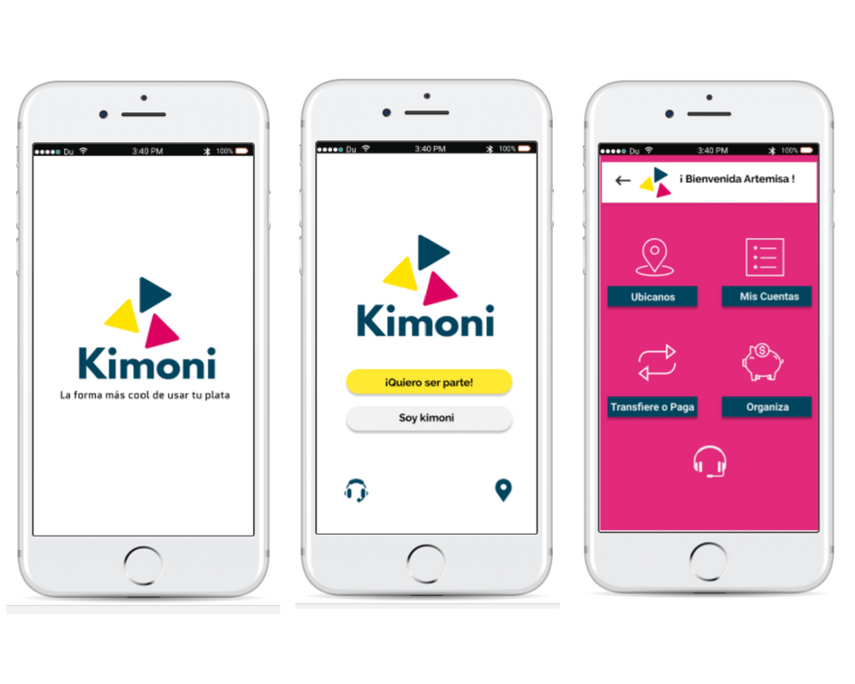
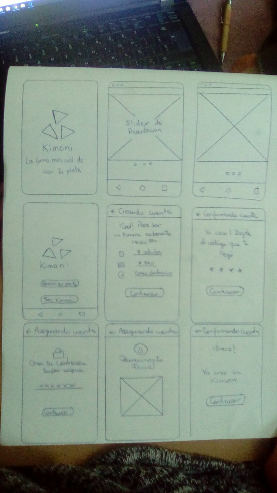
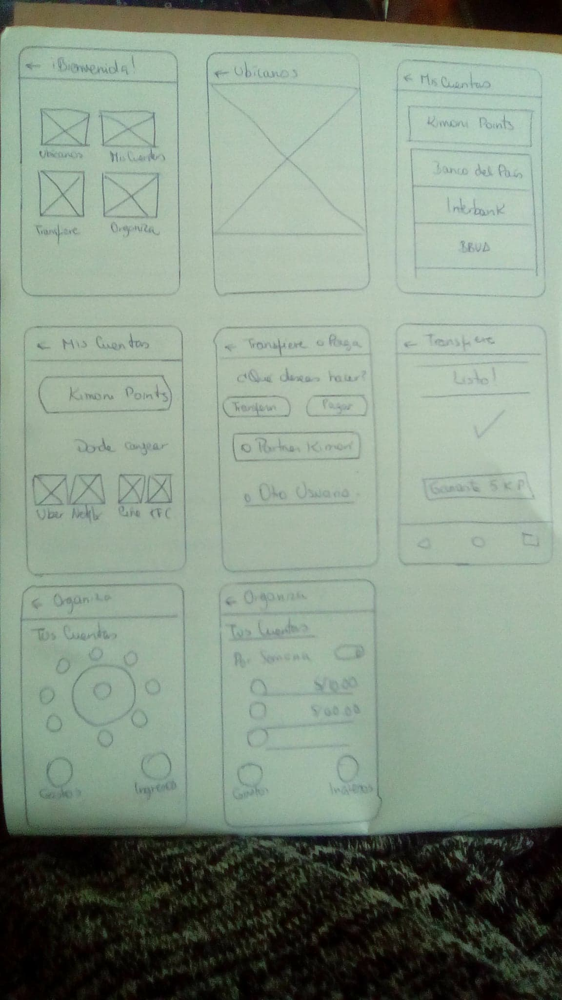

# Banco Millenial: KIMONI

Kimoni es una plataforma alternativa del sistema financiero, enfocado en brindar los beneficios de un banco tradicional a una nueva generación los  Millenials, una alternativa fresca y sencilla que permitirá realizar transacciones desde tu celular y disponer de todas tus cuentas, obteniendo Kimonipoints.

## Desarrollado para [Laboratoria](http://www.laboratoria.la/)

## RETO:CREAR UN BANCO 100% DIGITAL DIRIGIDO PARA MILLENIALS.

El Banco del País es uno de los bancos más importante de tu país. Es una institución de muchos años y actualmente está pasando por un proceso de transformación digital. Como parte de este proceso, han implementado un área de innovación que quiere llegar de una mejor manera a los usuarios más jóvenes. Por lo que, inspirados en Nequi, Nubank y Simple se han propuesto crear un banco 100% digital dirigido para millenials.

  

## ***DESARROLLO DEL PROYECTO***

### Día 1

### **PLANIFICACIÓN**

  

#### Día 1 :
  - Planificación del trabajo.  
  - BENCHMARKING:
     Nequi, Nubank, Simple.
     Fintech Nacionales.
  - Business Model Canvas
  - Plan Reunión KICKOFF
  - Planteamiento de preguntas a usuarios.

#### Día 2 :  
  - Planteamiento de preguntas a usuarios.
  - Elaboración de cuestionario /10 Preguntas (Online)  y guia de entrevista.
  - Elaboración de guia de entrevista a los Stackholders.

- **Ux Research** : Entrevistas a usuarios.  
- **Análisis de Usuario**  : Analizando la información recaudada.
    - Realizar un mapa de afinidad para detectar las necesidades del usuario.
    - Investigar empresas que ofrezcan servicios similares a las necesidades de los MILLENIALS.  

#### Día 3 :  
-  **Mapa de afinidad**
      - Realizar un mapa de afinidad o lluvia de ideas para detectar las necesidades del usuario.
      - Priorizar y decidir las necesidades que vamos a abordar
      - Potenciar y enfocar nuestro Business Model Canvas .
      - Hacer un benchmarking y buscar referencias relacionadas a la necesidades que buscamos satisfacer.  
- **Presentación del Propuesta** :
    -   Elaboracion de prototype.

#### Día 4:  
- **Definir el MVP**
    - Priorizar lista de features y definir el MVP.  

#### Día 5:
- **Testeo**
     - Hacer un content prototype.  
     - Testearlo en pareja con compañeras de otro squad.
     - Testeo del prototype a diferentes personas enfocandonos en los Milleneals.

#### Día 6:
- **Exposicion final**
     - Testeo del la ultima versión del prototype.
     - Presentación final del prototype.

### Desarrollo- Dia 1:

#### Reaserch a traves de internet:
Para empezar con el proyecto que nos encomendó el Banco del Pais, lo primero que tuvimos hacer fue una investigación a traves de nuestro gran aliado Google, con el fin de tener un contexto mas claro de transformacion digital, innovacion y millenials.

Para comprender el término “Transformación digital” debemos responder a la pregunta ¿Cómo usar la tecnologías para innovar en los negocios? ¿Cómo usar la tecnología para transformar los negocios?
Hay quienes están confundiendo la Transformación Digital con invertir en nuevas tecnologías para una mejora radical en el rendimiento de las empresas, pero resaltar que la tecnología por sí sola no es transformación digital.

Entonces, ¿Que es transformacion digital?
Transformación digital es el siguiente nivel en la evolución de los negocios, frente a una sociedad que se transforma a ritmos cada vez más acelerados, en donde la revolución digital ha cambiado y cambiará más la forma en cómo vivimos, trabajamos, y nos relacionamos con otras personas, es rol fundamental de las empresas transformarse para crear experiencias de mayor valor nunca antes vistas, transformando previamente y de forma integral la mentalidad, los procesos y las tecnologías tradicionales de las organizaciones para adaptarse a la economía digital que cada vez evoluciona a mayor velocidad.

Para ello, debemos tener en cuenta los siguientes requerimientos si queremos ser transformar digitalmente una empresa:

1.- La organización debe centrarse en las necesidades “reales” de los clientes sean internos o externos (Design Thinking o Pensamiento de diseño).

2.- Cambiar la forma en que se hacen las cosas, los procesos: cambiar los procesos en la organización (empresas innovadoras y ágiles)

3.- Invertir en nuevas tecnologías (que trae la revolución digital)

4.- y así generar nuevos modelos de negocio: es decir insertar la innovación en toda la empresa para competir en una economía digital cambiante a ritmos cada vez más acelerados.

*Millenials y la banca*
En los próximos cinco años, los *millennials* la generación de jóvenes que nació entre 1981 y 2000 supondrá el 75% de la fuerza laboral en el mundo. Con más de 80 millones de personas en Estados Unidos, otros 51 millones en Europa y unos 170 millones estimados a nivel global, la nueva generación de consumidores se está transformando en el foco de estrategias y campañas publicitarias de empresas de los más diversos rubros.

La banca no ha quedado ajena a este fenómeno y, actualmente, lucha por atraer y fidelizar a un grupo que rompe con los paradigmas de las generaciones anteriores, estableciendo nuevos hábitos de consumo y formas de relacionarse con las empresas.

Un estudio de la empresa fabricante de software de notificaciones financieras, Latinia, reveló que el 40% de los millennials nunca ha pisado una sucursal bancaria y que la mayoría no está familiarizado con las funciones que cumplen las instituciones financieras, pues muchos ven ajenos conceptos como tasas, intereses y créditos. Incluso, el mismo estudio destaca que el 53% de los encuestados no piensa que su banco sea diferente al de los demás, por lo que uno de cada tres estaría dispuesto a cambiar de entidad fácilmente.

Otro de los resultados del análisis refleja la afinidad de los millennials con la tecnología y los servicios de mensajería instantánea. La principal vía de comunicación entre estas instituciones y sus clientes son las páginas web y las aplicaciones que han desarrollado los bancos para smartphones , donde una buena o mala aplicación móvil puede sellar la imagen de la empresa frente a sus clientes más jóvenes. Entre los millennials peruanos, la red preferida por los usuarios es Facebook y la usan para enterarse de noticias y servicios disponibles en su banco.

Este cambio de escenario para la banca necesita de nuevas estrategias para lograr el éxito, en un mercado donde los clientes van de una institución a otra más fácilmente que antes. Por lo mismo, las prioridades han cambiado y también las inversiones en los distintos servicios que ofrecen a esta generación.

Los resultados de la encuesta anual realizada por Latinia en entidades españolas y latinoamericanas, reflejan una especial preocupación por la banca móvil y la experiencia del cliente, áreas que ocupan los primeros puestos en el listado de estrategias necesarias para abordar la transformación digital. El liderato de ambas refleja la preocupación de las instituciones por el tema, enfrentándose a una generación marcada por la desinformación financiera y lo instantáneo.

##### Benchmarking:
Los Bancos peruanos se han centrado en la experiencia del cliente y su foco hoy y al 2020 son los millennials.

Por ello ya iniciaron transformación digital creando equipos ágiles, Laboratorios de innovación y/o centros de innovación que serían como la semilla con el que buscan impactar en el sector.

###### Laboratorios de innovacion:
 - *BCP:* Centro de InnovacXión – Digitalmente
 - *BBVA Continental :* Con apoyo de su BBVA Innovation Center en España, quienes además tienen en la casa matriz un presupuesto de $250 Millones de dólares para invertir/comprar fintech y adquirir las mejores prácticas que puedan incorporarse a su adn corporativo. Además de haber desarrollado equipos ágiles.
 - *Interbank:* LaBentana, La Victoria Lab realizan el trabajo, aunque no han creado un centro de innovación, ellos están ahora enfocados no solo en la transformación digital, sino en la creación de Fintech.
- *Scotiabank:* Con su Digital Factory, su centro de innovación para la transformación digital a nivel global.

###### En otros paises:

- *Nequi:* Lo que mas nos gusto de la app de Nequi es que era muy distinta a las aplicaciones de los bancos antes mencionados, es una plataforma agil, amigable y facil de usar. Es por ello que tomamos de inspiracion y quisimos replicar el factor de usar el numero de celular como numero de cuenta.

### Día 2

## **UX RESEARCH Y ANALISIS DE USUARIO.**

## **Entrevistas.**

  

- Entrevistamos a 5 Milleneals de entre 23 a 27años para evaluar sus necesidades.
- Grabamos las entrevistas de los usuarios para centrarnos en el lenguaje corporal.  

### **Preguntas:**
1.	¿Cuántos años tienes?

2.	¿Aquí te dedicas?

3.	¿En qué distrito vives?

4.	Tienes alguna cuenta en el banco (crédito –debito)

5.	¿Cómo se llama el banco?

6.	¿Cómo manejas tus finanzas?

7.	¿Conoces los servicios que te ofrece el banco?

8.	¿Qué operaciones realizas con frecuencia? ¿A través de que medio?

9.	¿Probaste usar la banca por internet o aplicación?

10.	¿Te parece útil hacer tus transacciones por internet? ¿Atreves de que plataforma regularmente?

11.	¿Cuándo fue la última vez que realizaste una transacción financiera?

12.	¿Qué proceso realizaste y como te sentiste?

13.	¿Alguna vez has realizado un préstamo financiero? ¿Cuál fue el motivo?

14.	¿Tienes el hábito de ahorrar?

15.	¿Te gustaría que el banco te brinde consejos de ahorro?

16.	¿Qué características o servicios te gustaría a ti que un banco te proporcione?

####**Resumen de feedback de los entrevistados:**

  - *No tengo una cuenta en el banco.*
  - *Me gustaria manejar todas mis cuentas desde una sola aplicacion*   
  - *Ahorro en mi chanchito.*   
  - *No tengo mucha información de los servicios que ofrece un banco.*  
  - *Me gustaria que me ayude a controlarme en no gastar en cosas que no necesito .*
  - *Usar la banca por internet o desde una aplicacion me resulta muy util*

#### **Según las encuestas que realizamos el 60% de los Millenials nos indican que desean :**  

## **Encuestas on-line.**
Se encuesto a 24 Millenials entre 20 y 29 años para averiguar sus necesidades así como inquietudes más recurrentes que atraviezen.

   

#### Día 3
## **DIAGRAMA DE AFINIDAD**

Se desarrolló el análisis de las encuestas realizadas para poder recopilar toda la información sumando los resultados de las entrevistas presenciales.

Empleamos el **Diagrama de Afinidad** para poder identificar  y clasificar los diversos problemas encontrados.

Se consideró clasificar las necesidades e inconvenientes por temas.

Por ejemplo :
- Información más clara y sencilla de entender.
- Disponer de todas sus cuentas desde una sola aplicación .
- Poder realizar diversas transacciones sin exceso de cobro en comisiones.
- Beneficios por el uso de sus operaciones.

 **¿Por qué KIMONI?**

  Queriamos que nuestro nombre sea fácil de pronunciar y de recordar. Es por ello elegimos la palabra Kimoni, que viene del inglés Keep your money (Guarda tu dinero) y le dimos un cambio interesante.

#### Día 4
## **DIAGRAMA DE AFINIDAD**

## *Paper Prototyping*

##- **Testeo**

El Paper Prototyping lo pudimos testear con 2 millenials, los cuales nos dijeron que el proceso era entendible y facil, pero nos dieron el alcance de que en la parte de reconocimiento facial, seamos mas explicitos diciendo que hacer, ya que es algo nuevo, y en la proceso de transferir nos recomendaron que seria bueno poder mandar un mensaje personalizado y editar los nombres de las personas a las que se hara el depósito para que haya más interacción.

#### Día 5:
- **Testeo**

     - Se logro  testearlo en pareja con compañeras de otro squad asimilando  de manera efectiva el feedback correspondiente.
     - Se realizo testeo tambien con los usuarios y mostraron gran interes por la sencillez y grandes beneficios que les proporciona Kimoni .

- **Prototipo Interactivo en FIgma y Marvel**

https://marvelapp.com/project/2596116/

#### Día 6:
- **Exposicion final**
     - Testeo del la ultima versión del prototype.
     - Presentación final del prototype.

     
